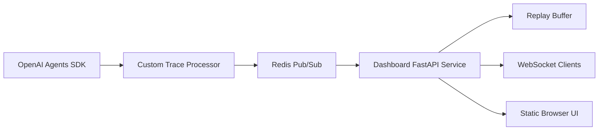

# OpenAI Agent SDK Dashboard

Self-hosted live dashboard for OpenAI Agents SDK workflows. It receives normalized trace events,
keeps a short replay buffer, and streams status changes to a read-only browser UI over WebSocket.

The project goal is operational visibility without data leakage: operators can see whether an agent
workflow is active, slow, completed, or failing, while developer-only views can expose deeper span
details behind a separate token.

## What It Provides

- FastAPI service with health, replay, and WebSocket endpoints.
- In-memory replay buffer for the latest events.
- Token-based viewer and developer access levels.
- Static browser UI with a configurable workflow graph.
- Redis Pub/Sub subscriber for trace-event ingestion.
- OpenAI Agents SDK trace processor adapter for upstream applications.
- Docker Compose setup with Redis kept internal by default.
- CI, tests, security policy, contribution guide, and release rules.

## Non-Goals

- Mutating or controlling live agent workflows.
- Storing long-term traces or customer data.
- Replacing dedicated tracing tools for deep offline analysis.
- Publishing tenant-specific prompts, contact data, or workflow context.

## Architecture



The upstream application publishes JSON trace events to Redis. The dashboard subscribes to the
configured channel, normalizes the payload, stores the latest events in memory, and broadcasts each
event to connected clients.

## Quick Start

```bash
cp .env.example .env
docker compose up --build
```

Open `http://localhost:8090`, enter the viewer token from `.env`, and connect.

For local development without Docker:

```bash
python3 -m venv .venv
. .venv/bin/activate
pip install -e ".[dev]"
DASHBOARD_ENABLE_REDIS_SUBSCRIBER=false uvicorn dashboard_service.main:create_app --factory --reload --port 8090
```

## Configuration

Runtime settings are environment-driven. See [.env.example](.env.example) and
[docs/configuration.md](docs/configuration.md).

Workflow graph labels, node IDs, and visual mappings live in
[`dashboard_service/config/default.dashboard.json`](dashboard_service/config/default.dashboard.json).
Tenant-specific deployments should provide their own config file through `DASHBOARD_CONFIG_PATH`.

## Agents SDK Integration

Register the dashboard trace processor in the upstream agent application:

```python
from dashboard_service.agents_sdk import register_dashboard_trace_processor

register_dashboard_trace_processor()
```

Use `add_trace_processor()` semantics so the dashboard receives trace events without replacing the
OpenAI Agents SDK default tracing exporter. See [docs/agents-sdk-integration.md](docs/agents-sdk-integration.md).

## Development Checks

```bash
ruff check .
mypy dashboard_service scripts tests examples
pytest
```

When private customer terms are known locally, run:

```bash
PRIVATE_TERM_PATTERNS="term-one;term-two" python scripts/check_public_terms.py
```

## Local Live Test

Run the dashboard without Redis and inject neutral demo events:

```bash
DASHBOARD_ENABLE_REDIS_SUBSCRIBER=false \
DASHBOARD_ENABLE_DEV_TOOLS=true \
DASHBOARD_AUTH_TOKEN=viewer-token \
DASHBOARD_DEVELOPER_AUTH_TOKEN=developer-token \
uvicorn dashboard_service.main:create_app --factory --reload --port 8090
```

Open `http://localhost:8090`, connect with `viewer-token`, then publish demo events:

```bash
python scripts/publish_demo_events.py --token developer-token
```

See [docs/live-testing.md](docs/live-testing.md).

## Security

The default Compose file binds the dashboard to `127.0.0.1:8090` and keeps Redis off the host
network. Put a TLS reverse proxy in front of the service for production use.

See [SECURITY.md](SECURITY.md) and [docs/security-model.md](docs/security-model.md).

## Release Model

This repository uses SemVer and Keep a Changelog. See [CHANGELOG.md](CHANGELOG.md) and
[docs/release.md](docs/release.md).
