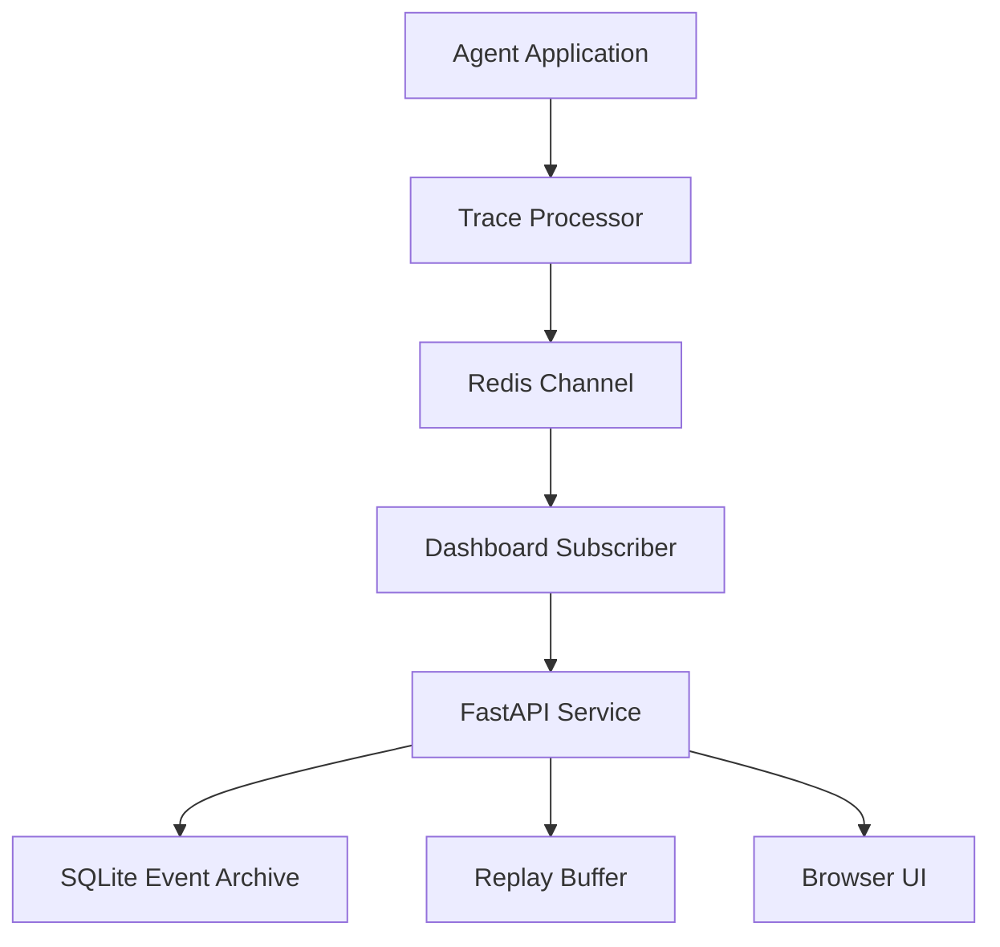

# Architecture

## System Intent

The dashboard gives operators and developers live visibility into OpenAI Agents SDK workflows without
granting write access to the upstream system. It is an observation layer, not a control plane.

## Components

## Event Flow

1. The upstream agent application registers the dashboard trace processor with the OpenAI Agents SDK.
2. The processor maps trace and span lifecycle callbacks into normalized JSON events.
3. Events are published to the configured Redis channel.
4. The dashboard service subscribes, validates the payload, and writes it to the SQLite archive.
5. The latest events are also held in memory for quick replay.
6. Connected browsers receive replay events on connect and live events after that.

The browser can either render a configured static topology or derive a runtime topology from the
latest trace/span hierarchy. Runtime graphing stays client-side and read-only; it uses structural
fields from normalized events and does not request raw prompt or tool payload details.

## Runtime Boundaries

- Redis is the event bus only. It is not the system of record.
- SQLite is the local event archive and search index.
- The publisher adapter belongs in the upstream agent application process.
- The replay buffer is intentionally short-lived and in memory.
- The browser UI receives role-filtered payloads.
- Runtime graph zoom and layout state remain local to the browser session.
- The service does not expose endpoints that mutate upstream workflows.

## Data Model

The internal event contract is intentionally small:

- `event_type`: trace, span, status, or error lifecycle event.
- `status`: active, success, error, idle, or unknown.
- `node_id`: optional graph node to highlight.
- `trace_id`: trace correlation identifier.
- `span_id` and `parent_span_id`: span hierarchy used by the runtime graph view.
- `agent_id`, `tool_name`, and `span_type`: semantic span identifiers used by the runtime graph
  view.
- `session_id`: optional session identifier, pseudonymized for viewer clients.
- `summary`: human-readable status line.
- `detail`: developer-only diagnostic payload.

Viewer clients receive only structural metadata needed for runtime graphing, such as workflow name,
span type, agent name, tool name, model name, turn number, and handoff endpoints. The publisher
omits diagnostic detail by default. Deployments that explicitly enable detail payloads must treat
Redis and developer WebSocket clients as sensitive diagnostic surfaces.

## Event Archive

SQLite stores one row per normalized dashboard event. Frequently filtered fields such as status,
event type, node, trace, session, and timestamp are indexed. The complete normalized event JSON is
kept for developer-token replay while viewer responses continue to redact sensitive fields.

## Deployment Model

The default deployment is Docker Compose:

- `dashboard`: FastAPI, WebSocket, static UI.
- `redis`: internal Redis instance.
- optional `phoenix`: local-only debug profile for development environments.

Production deployments should place a TLS reverse proxy in front of `dashboard` and should avoid
exposing Redis or debug tooling to public networks.
