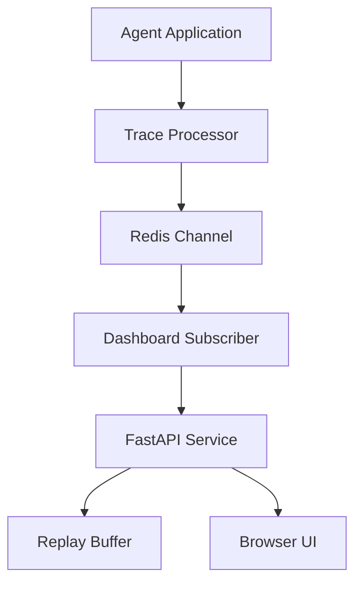

# Architecture

## System Intent

The dashboard gives operators and developers live visibility into OpenAI Agents SDK workflows without
granting write access to the upstream system. It is an observation layer, not a control plane.

## Components

## Event Flow

1. The upstream agent application registers a trace processor.
2. The processor maps trace and span lifecycle callbacks into normalized JSON events.
3. Events are published to the configured Redis channel.
4. The dashboard service subscribes, validates the payload, and stores the latest events in memory.
5. Connected browsers receive replay events on connect and live events after that.

## Runtime Boundaries

- Redis is the event bus only. It is not the system of record.
- The replay buffer is intentionally short-lived and in memory.
- The browser UI receives role-filtered payloads.
- The service does not expose endpoints that mutate upstream workflows.

## Data Model

The internal event contract is intentionally small:

- `event_type`: trace, span, status, or error lifecycle event.
- `status`: active, success, error, idle, or unknown.
- `node_id`: optional graph node to highlight.
- `trace_id`: trace correlation identifier.
- `session_id`: optional session identifier, pseudonymized for viewer clients.
- `summary`: human-readable status line.
- `detail`: developer-only diagnostic payload.

## Deployment Model

The default deployment is Docker Compose:

- `dashboard`: FastAPI, WebSocket, static UI.
- `redis`: internal Redis instance.
- optional `phoenix`: local-only debug profile for development environments.

Production deployments should place a TLS reverse proxy in front of `dashboard` and should avoid
exposing Redis or debug tooling to public networks.
